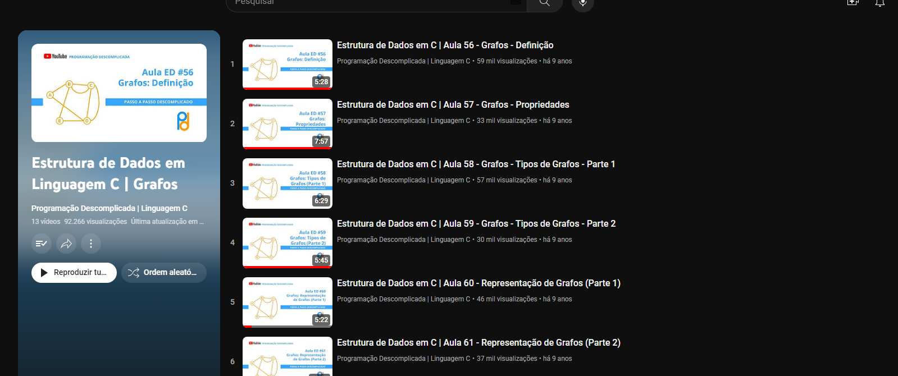

# 👾 Créditos

###  Canal do YT: [Programação Descomplicada | Linguagem C](https://www.youtube.com/@progdescomplicada)

### Playlist: [Estrutura de Dados em Linguagem C | Grafos](https://www.youtube.com/playlist?list=PL8iN9FQ7_jt4oQHq1TSeMgvVdolJvYsLO)

#### Observação: Este código foi copiado apenas para estudar grafos. Provavelmente, o mesmo contém diversos erros, já que usei para aprendender a estrutura da linguagem C.